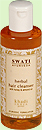
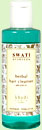

# Hair Care

* Herbal Hair Cleanser with honey & vanilla:- Herbal cleanser with the warm fragrance of vanilla and honey blended with indian herbs which cleanses the scalp and makes the hair healthy and silky, also prevents hair fall
* Herbal Hair Cleanser with honey & almond oil:- An excellent combination of honey & almond oil and mild indian herbs which cleanses the scalp and conditions the hair naturally. Prepared for all types of hair.
* Herbal Hair Cleanser With mint oil:- This herbal combination of mint oil, neem, tulsi, almon oil and pure herbs cleanses the scalp and conditions the hair naturally. Excellent for dull, dry and damaged hair.
* Anti Dandruff Hair Cleanser with tea tree & rosemary
* Saffron Reetha Protein Hair Cleanser for dry and dull hair
* Neem Sat Hair Cleanser with neem & tulsi
* Shikakai Sat Hair Cleanser scalp therapy
* Sat Ritha Hair Cleanser herbal sat
* Neem Kauri herbal sat
* Herbal Hair Conditioner with jasmine & aloevera
* Sesame Hair Oil an ideal remedy
* Anti Dandruff Hair Oil with tea tree & rosemary
* Maha Bhringraj Tel root strengthening
* Trifladi Tel scalp therapy
