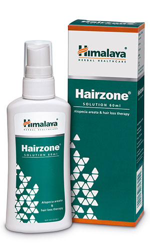

# Hairzone

**Hairzone** prevents follicle degeneration and stimulates hair growth. It also enhances hair tensile strength, promotes hair follicular density and hair follicle count. Hairzone inhibits chemotherapy-induced dystrophic changes in growing follicles and premature regression of severely damaged hair follicles.

**Provides symptomatic relief**: Hair fall is a common symptom associated with a dry and itchy scalp. The natural ingredients in Hairzone are potent antimicrobial and astringent agents. They effectively manage fungal, bacterial and viral infections of the scalp, which reduce itchiness, dryness and hair fall.

## Key ingredients
**Palasha** (Butea monosperma) inhibits hair follicular degeneration and extends the anagen (hair growth) phase. It is an astringent which relieves minor skin irritation resulting from scalp fungal infections. Palasha is also an antioxidant with potent free radical scavenging properties, which prevents hair fall.

**Palashabheda** (Butea parviflora) is an antimicrobial agent that effectively eliminates bacteria, viruses and fungi from the scalp.
