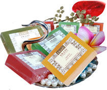

# Handmade Natural Soaps

Ayurvedic handmade glycerin soaps are transparent and are formulated with a unique combination of skin care & protection - enhancing herbal oils and extracts which leaves the skin cleans, moisturised & fragrant, lifts impurities gently without disturbing the normal oil - moisture balance of the skin.

## Key ingredients
* Rose
* Jasmine
* Lavender
* Sandal
* Rosewater
* Khus
* Mint
* Orange
* Lemon
* Strawberry
* Mango
* Musk
* Tea Tree
* Oceanic
* Lemon Grass
* Passion Fruit
* Neem - Tulsi
* Green Tea - Mint
* Almond - Aloe Vera
* Haldi - Chandan
* Almond - Honey
* Honey - Vanilla
* Ginger - Orange
* Neem - Aloe Vera
