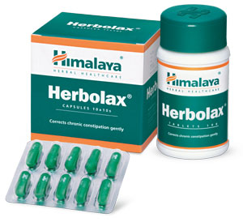

# Herbolax

[TOC]

The natural ingredients in **Herbolax** soften the stool and enhance intestinal motility, which relieve acute and chronic constipation effectively. Due to its laxative property, the drug assists excretion without upsetting the fluid-electrolyte balance (mineral and water balance) in the body. Herbolax is non-habit forming and does not result in physiological dependence.

**Other actions**: For effective preradiographic bowel preparation, Herbolax in conjunction with Himalaya’s **Gasex**, eliminates gas shadows, ensures better radiological interpretation and avoids repeated exposures.

## Key ingredients
**Trivruth** (Ipomoea turpethum) is a mild laxative that treats constipation of varied etiologies.

**Chebulic Myrobalan** (Haritaki) is revered in Ayurveda for its natural laxative property, which does not interfere with normal intestinal physiology. As a prokinetic agent, the herb stimulates intestinal motility and smooth muscle contraction, causing increased intestinal peristalsis. This action aids digestion and the absorption of food.

## List of Ayurvedic herb in which used in this preparation
[Aloe vera](Aloe_vera.md)
