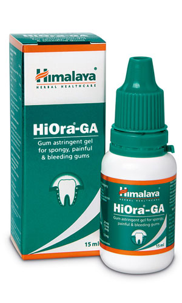

# HiOra-GA Gel

The astringent and antiseptic properties of HiOra-GA Gel address gingivitis of various etiologies. It is a hemostatic (stops bleeding) that prevents gum bleeding and helps in strengthening gums. The gel reduces gum inflammation, heals wounds, refreshes breath and kills bacteria in the oral cavity.

**Pain relief:** Its natural ingredients act as an analgesic to reduce pain inside the mouth.

**Periodontitis:** HiOra-GA Gel inhibits matrix metalloproteinases induced tissue destruction, which is one of the predominant factors in periodontitis or gum disease.

## Key ingredients
**Triphala**, a herbal remedy, inhibits bacterial growth on the surface of the teeth. A recent study has revealed that it could also be useful in root canal irrigation. Triphala inhibits tissue destruction that could eventually cause gum disease.

**Indian Kino Tree** (Asana) has astringent and anti-inflammatory properties, which are helpful in relieving toothache and stopping gum bleeding.
