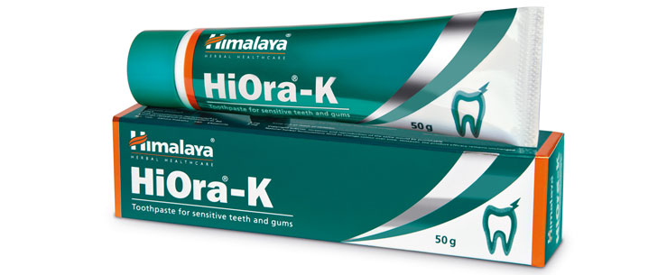

# HiOra-K Toothpaste

**Desensitizing:** Naturally-derived potassium helps in desensitizing dental nerves and relieves tingling sensation and pain associated with sensitive teeth.

**Dental tubules occlusion:** The natural ingredients in the toothpaste help form a protective layer on the tooth enamel and plug exposed dentinal tubules.

**Strengthens gums:** HiOra-K Toothpaste contains natural astringents that help tighten gums and prevent them from receding. This helps gums fit closely around teeth and prevent enamel erosion, which is the primary cause of sensitive teeth.

## Key ingredients
**Naturally derived Potassium nitrate** (Suryakshara) inhibits pain in hypersensitive teeth through its desensitizing effect on dentinal nerves.

**Spinach**(Palakya) contains natural oxalate compounds, which help in forming phytocomplexes on the teeth. This occludes dentinal tubules and blocks the transmission of pain from the surface to the tooth’s nerves. These oxalate compounds produce protective films on the molars and thus, helps to prevent tooth destruction.

**Clove** (Lavanga) contains an anesthetic chemical compound called eugenol, which numbs nerves and controls pain. The essential oil of clove is also an antiseptic which helps to eliminate oral bacteria.
