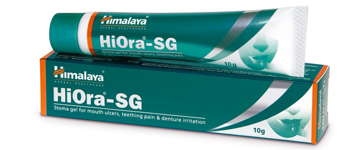

# HiOra-SG Gel

**Heals mouth ulcers:** The antibacterial, anti-inflammatory, anti-allergic, wound-healing and analgesic properties of **HiOra SG Gel** help to heal mouth ulcers quickly. The gel also modulates the body’s immune response and prevents the recurrence of mouth ulcers.

**Relieves teething pain:** HiOra-SG Gel contains natural ingredients which help relieve teething pain.

**Denture irritation:** It also relieves pain and irritation caused by dentures.

## Key ingredients
**Jasmine** (Jati) helps to heal wounds faster. The herb also has antimicrobial action against oral bacteria responsible for in denture-induced stomatitis (oral ulcers).

**Licorice** (Yashtimadhu) contains the chemical constituent deglycyrrhizinated licorice,whichis helpful in healing ulcers and combating microorganisms on the oral mucosa.

**Spreading Hogweed** (Punarnava) has an anti-inflammatory property which helps reduce local inflammation.

**Triphala** has ulcer-healing properties and reduce inflammation.
