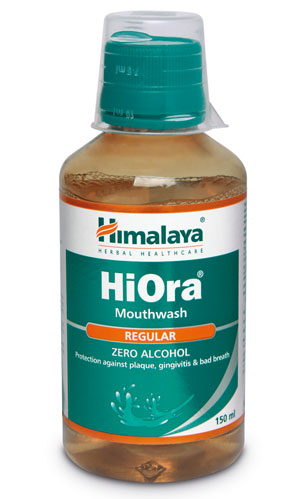

# HiOra Mouthwash

Through its antimicrobial, antiseptic properties and active herbal ingredients, **HiOra Mouthwash-Regular** combats common oral bacteria and fungi. This action reduces gum and tooth disease as well as the build-up of plaque.

**Protects gums**: It helps to strengthen and tone gums.

**Halitosis**: HiOra Mouthwash-Regular reduces bad breath, refreshes mouth and maintains oral hygiene.

## Key ingredients
**Meswak** (Salvadora Persica) tree twigs, known as meswak, are popular teeth-cleaning agents. Pilu prevents tooth decay and eliminates toothache and bad breath.

**Betel** (Nagavalli) leaf effectively tackles halitosis, and its mild stimulating properties are beneficial for toothaches.

**Belleric Myrobalan** (Bibhitaki) is an antimicrobial and antifungal agent that keeps infections at bay.
