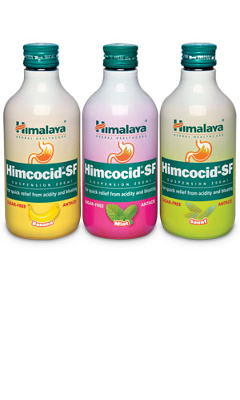

# Himcocid-SF

Due to its ulcer-healing and gastroprotective properties, the natural ingredients in **Himcocid-SF** combat ulcers and gastritis. It neutralizes gastric acid, relieves gaseous distension and bilious and dyspeptic symptoms. Himcocid-SF suspension is sugar-free and aluminum-free, and, therefore, is safe in diabetics and hypertensives.

## Key ingredients
**Cowrie Shell Ash**(Varatika) is well known for its antacid and digestive properties that are useful in the treatment of gastritis, hyperacidity, heartburn and duodenitis.

**Indian Gooseberry** (Amalaki) effectively reduces the acid and pepsin content in the stomach. At the same time, it increases the mucin, cellular mucus and life span of gastric mucosal cells, which helps in healing stomach ulcers. As an antioxidant, Indian Gooseberry protects the gastric mucosa from oxidative damage.
