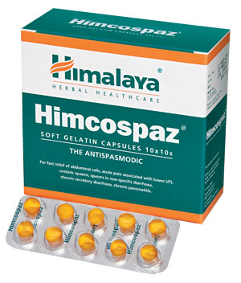

# Himcospaz

**Himcospaz** inhibits the contractions induced by several spasmogens (agents that produce muscle spasms) like acetylcholine and histamine.

**Other actions**: While relieving non-specific abdominal colic, Himcospaz improves digestion and controls diarrhea. As an anti-inflammatory and analgesic agent, the drug is effective in alleviating the pain associated with menstrual cramps. Prostaglandin inhibitors found in Himcospaz are effective in the treatment of dysmenorrhea and other smooth muscle colic.

## Key ingredients
**Celery** (Ajamoda) has spasmolytic (arresting spasms) properties, which are especially beneficial in relieving gastrointestinal tract spasms.

**Ginger** (Sunthi) inhibits both acetylcholine-evoked and electrically-induced smooth muscle contractions. The spasmolytic property is attributed to the active chemical constituent in Ginger, gingerol, which also inhibits the biosynthesis of prostaglandins (lipid compounds that have a role in pain perception). Ginger is also an anti-inflammatory that helps in the management of pain and discomfort associated with inflammatory changes in the gastrointestinal tract.
