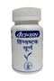

# Hiṇgvaṣṭaka Cūrṇa

[TOC]

**Hiṇgvaṣṭaka Cūrṇa** is a powder preparation containing the ingredients in the Formulation composition given below:

## Formulation composition
| Śuṇṭhī API | [Zingiber officinale](../herbs/Zingiber_officinale.md) | Rz. | 1 part |
| --- | --- | --- | --- |
| Marica API | [Piper nigrum](Piper_nigrum.md)[ | Fr. | 1 part |
| Pippalī API | [Piper longum](Piper_longum.md) | Fr. | 1 part |
| Ajamodā API | [Apium leptophyllum](Apium_leptophyllum.md) | Fr. | 1 part |
| Saindhava lavaṇa API | Rock salt |  | 1 part |
| Śveta jīraka API | [Cuminum cyminum](Cuminum_cyminum.md) | Fr. 1 | part |
| Kṛṣṇa jīraka API | [Carum carvi ]] | Fr. | 1 part |
| Hiṇgu API-śuddha | [Ferula foetida](Ferula_foetida.md) | Exd. | 1 part |

## Method of preparation
* Take all ingredients of pharmacopoeial quality.
* Roast coarsely powder Saindhava lavaṇa in a stainless steel pan till it become free from moisture. Prepare fine powder and pass through it sieve number 85.
* Treat Hiṇgu to prepare śuddha Hiṇgu. Clean and powder all other ingredients individually, pass through sieve no. 85, weigh each ingredient separately and mix thoroughly in specified ratio to obtain a homogeneous blend.
* Pack it in tightly closed containers to protect from light and moisture.

## Description
* Light brown; free flowing powder with a spicy and astringent taste, odour aromatic and pleasant. The powder completely pass on through sieve number 44 and not less than 50 per cent pass on through sieve number 85.

## Storage
* Store in a cool place in tightly closed containers, protected from light and moisture.

## Therapeutic uses
* Agnimāndya (Digestive impairment), Śūla (Pain/Colic), Gulma (Abdominal lump), Vātaroga (Disease due to vata dosha).

## Dose
* 3 to 6 g daily in divided doses.

## Anupāna
* Ghrta.

## Physico-chemical parameters
| Loss on drying | Not more than 13.5 per cent |
| --- | --- |
| Total ash | Not more than 23.0 per cent |
| Acid-insoluble ash | Not more than 4.5 per cent |
| Alcohol-soluble extractive | Not less than 14.0 per cent |
| Water-soluble extractive | Not less than 34.0 per cent |
| pH (1% aqueous solution) | 6.4 to 6.6 |

## References

## References

1. THE AYURVEDIC PHARMACOPOEIA OF INDIA, PART-II, VOLUME-1, page no 48.
