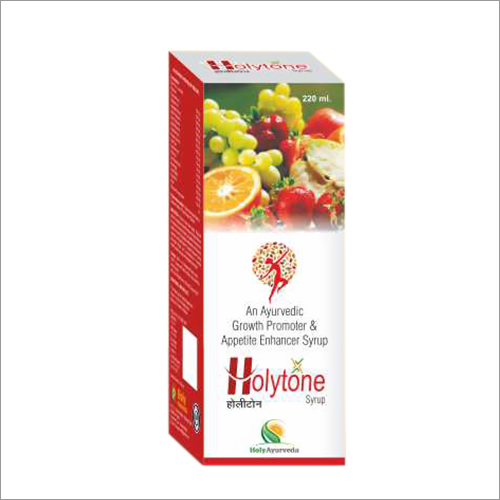

# Holytone Syrup

Holytone can be used as a foundation for the management of any chronic disorder, or to promote optimum health and energy levels. It should be specifically considered for people with depressed mood, fatigue, digestive complaints, memory enhancement, and the effects of aging.  It can also be used as a supportive health measure during times of excess physical or mental stress.

Holytone may be especially helpful for people that are in poor health. It contains herbs that are traditionally beneficial to the digestive system, liver, endocrine system, adrenal system, and circulatory system.

## COMPOSITION
Each 10ml contains extracts of:-

* Palak(Spinacia oleracea) -                                  100mg
* Chukunder(Beta vulgaris) -                                100mg
* Shatavar(Asparagus racemosus) -                    100mg
* Aswagandha(Withania somnifera) -                 150mg
* Kauch(Mucuna pruriens) -                                  100mg
* Arjun(Terminalia arjuna) -                                   100mg
* Safed mushli(Asparagus adscendens) -             100mg
* Vidarikand(Ipomoea digitata) -                           100mg
* Pipramool(Piper longum) -                                   50mg
* Sonth(Zingiber officinale) -                                   30mg
* Kali mirch(Piper nigrum)                                    30mg
* Piper(Piper longum)                                            30mg
* Loh bhasma soluble                                                     25mg
