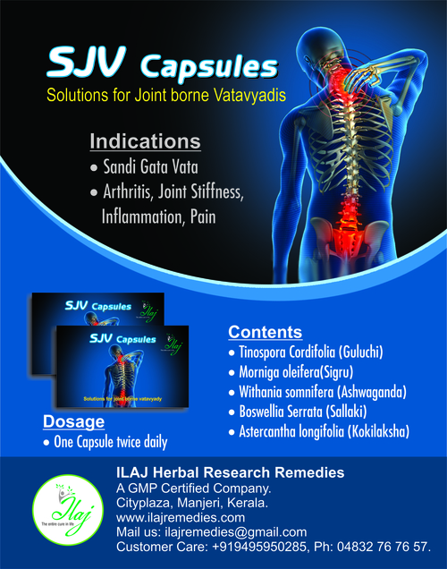

# Ilaj Ayurvedic Medicines

* **Herbal Herborouse Capsule** - This medicine  provides impressive cure for sexual disorders, aid individuals to conquer any kind of sexual weakness during the reproductive period and restore the amicable family relationship.

* **Herbal Plantar Corn Medicine** - Herbal Plantar Corn Medicine to eradicate a surgically manageable disease with simple internal medicine, not only cures but it prevents the recurrence.

* **Herbal Piles Medicine** - Herbal Piles Medicine is an effective treatment for piles and related problems because it will promote an easy bowel movement and intestinal function along with curing the basic illness.

* **Herbal Leucorrhoea Medicine** - Effective action on the  uterine musculature to improve the circulation as well as strengthen the genital tract.

* **Ayurvedic Likoria Lehyam** -   Powerful and high potent combination that cures chronic Leucorrhoea of varied etiology.

* **Ayurvedic Constipation Lehyam** - This drug is highly effective in the treatment of acid peptic disease, heartburn and gastritis.

* **D-Tox Lehyam** -  An excellent blood purifier and can heal hematological disorders.

* **Ayurvedic Heart Medicines** - VTH pill is a wonderful poly herbal formulation which is indicated for atherosclerosis and related ischemic heart attacks, the medicine has the capacity to mediate the lysis of atherosclerotic plaques.

* **Ayurvedic Migraine Pills** - An effective solution for all sorts of migraines, Prevents pre-monitory symptoms and reduces the acuteness of migraine

* **Ayurvedic Pain Reliever** -  Significant anti inflammatory and analgesic activity. Joint detoxifying, cooling and anti inflammatory herbs to take heat, pain and inflammation out of joint.

* **Ayurvedic Diabetes Medicine** -  Repair and regenerate beta cell activity. Improves peripheral utilization of glucose. Maintains healthy blood glucose level.

## External Links
* [Ilaj Herbal Research Remedies](http://ilajherbalresearch.tradeindia.com/products.html)
