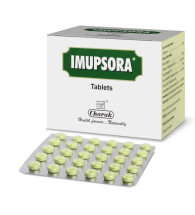

# Imupsora Tablet

**The natural approach to the management of psoriasis**

Imupsora tablet is a comprehensive therapy for Psoriasis. The key ingredient Manjishta (Rubia cordifolia) exhibit keratolytic activity that helps to the soften and shed of the horny outer layer of the skin in psoriasis. Manjishta (Rubia cordifolia) with Guduchi (Tinopsora cordifolia) and Triphala help in immune modulation and also exhibit antiseptic and antibacterial property. Haridra (Curcuma longa) have antiinflammatory and antipruritic activity. Katuki (Picorrhiza kurroa) exerts UV-potentizing action. Parpata (Fumaria officinalis) reduces the excess epithelial proliferation of psoriatic lesions. The antioxidants of Triphala and Sariva (Hemidesmus indicus) help in the restoration of skin texture (smoothening of cracked, painful epidermis). Guduchi (Tinospora cordifolia) improves immune-competence while Tulsi (Ocimum sanctum) has anxiolytic and anti-depressant activity.
