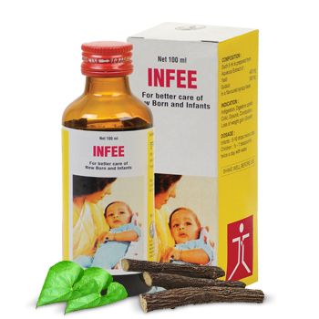

# Infee

[TOC]

The protective shield for every child. Indication: Recurrent respiratory and gastrointestinal tract infections.

## Composition
Each 5ml contains - Aqueous extract derived from: Yashtimadhu (Glycyrrhiza glabra) 400 mg Guduchi (Tinospora cordifolia) 300 mg in a flavored syrupy base.

## Dosage
Infants: 5-10 drops twice a day with water. Children: 1/2 to 1 teaspoonful a day with water.

* Builds immunity, boosts recovery. Ensures healthy growth of a child. Protects the child from reccurent respiratory and gastrointestinal tract infections.
