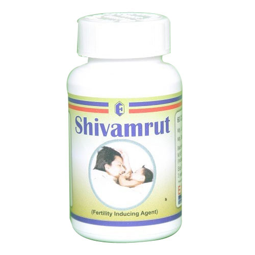

# Infertility Medicines

[TOC]

**Shivamrut Capsule** is helpful in following cases:

* Promotes healthy and regular ovalution without the risk multiple birth
* Improves overall systemic health
* Promotes ovarian health
* Increase fertility and improves the functioning of the male and female reproductive system
* Gives strength to the fallopian tubes

## Composition:
* Shivlingi - Bryonopsis Laciniosa Lin 250 mg
* Paraspipul - Tehspesis poputeca 250 mg

## External Links
* [Ethichem Laboratories](http://www.indiamart.com/ethichemlaboratories/infertility.html)
