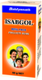

# Issabgol

[TOC]

## Importance
Issabgol husk is indigestible and is a source of soluble dietary fibre. It is used to relieve constipation, irritable bowel, and diarrhoea. It is also used as a regular dietary supplement to improve and maintain regular GI transit. It is excellent remedy to control Cholesterol.

## Dosage
One teaspoon with milk, curd or water at bedtime. Maybe altered according to individual requirement.

## Indications
1. Colon cleanser
1. Control cholesterol in body
1. Useful in piles, fissures and fistula
1. Cure cardiovascular disease.
