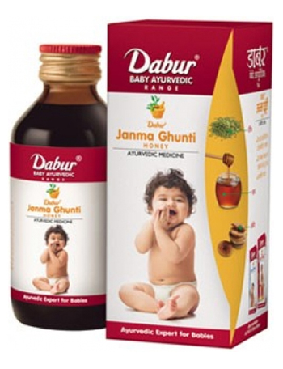

# Janma Ghunti

Dabur Janma Ghunti, an Ayurvedic medicine, plays a dual role in all-round growth of infants.

Dabur Janma Ghunti  acts as an effective remedy for stomach ailments arising out of teething such as flatulence, constipation, diarrhoea, vomitting etc. It also helps in the growth process by expelling intestinal worms and toning up the digestive system of the infant with the goodness of traditional Ayurvedic ingredients like Anjeer, Kishmish, Ajwain etc.

## Ingredients
* Anjeer: Good for the infant's liver, it acts as a cooling & soothing agent for the stomach and has high nutritive value
* Draksha/Kishmish: Contains essential minerals like calcium, magnesium, potassium and iron in an assimilable form. It is an expectorant, laxative and blood purifier, and is useful in fevers and colds arising due to thrush in children
* Ajwain: Prevents flatulence, indigestion, colic dyspepsia & diarrhea
* Palas Beej & Bidang: Expel intestinal worms
* Vach: Prevents flatulence & loss of appetite. Useful in dyspepsia and choleric diarrhea
* Amaltas: Acrts as a laxative, especially for habitual constipation
* Sanai: Mild laxative
