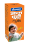

# Janma ghunti kadha

[TOC]

## Importance
Baidyanath Janm Ghunti is an excellent remedy for growing infants. It prevents and cures from common infantile digestive disorders, diarrhoea and vomiting. It prevents cough and cold in children and Builds resistance against internal infection. It helps in toning up the body and eases teething in infants.

## Dosage
1-3 Months ¼ teaspoons (small) 4-6 months ½ teaspoons (small) 7- 2yrs. 1-2 teaspoons (small)

## Indications
1. Helpful in teething in infants.
1. Effective in Stomach Ailments
1. Cures digestive disorder.
1. Enhances immunity in infants.
