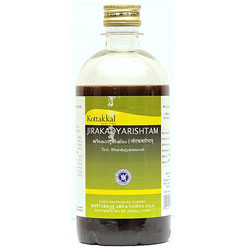

# Jirakadyarishtam

[TOC]

This Ayurvedic formula is known for helping women during their post-delivery time period. It helps the normal involution of the uterus and helps the mother to lactate better for the baby. It also helps in all cases of indigestion, such as diarrhea and indigestion.

The main ingredient here is Cumin.

## Dosage of Kottakkal Ayurveda Jirakadyarishtam
12 ml, after food, two times a day for a period of 2 – 3 months.

## Indications for use of Kottakkal Ayurveda Jirakadyarishtam
**After delivery complications in the mother**
* Fever
* Indigestion
* Cough
* Cold
* Malabsorption syndrome
* Diarrhea
* Digestive disorders.

## Ingredients of Kottakkal Ayurveda Jirakadyarishtam
White caraway, Water, Jaggery, Fire Flame Bush, Ginger, Nutmeg, Nutgrass, Cardamom, Indian Bay Leaf, Cinnamon, Ironwood Tree, Ajwain, Cubeb, Clove
