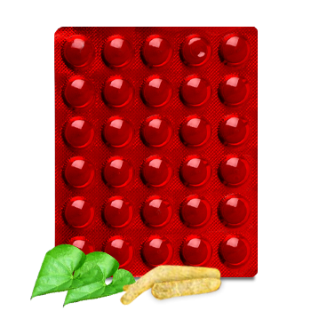

# K4

[TOC]

Broad spectrum urinary antiseptic.
Indications are as follows: Urinary tract infections, urethritis, burning micturition, crystalluria, renal and urinary calculi, cystitis.

## Composition
Each tablet contains- Chandraprabha 120 mg Guduchi(Tinospora cordifolia) 120 mg Kanyalohadi 40 mg Haridra(Curcuma longa) 20 mg Bhavna of Bilvapatra Swaras and Karela Swaras.

## Dosage
For UTI, 2 tablets twice a day with water or milk for 2-4 weeks. In Burning micturition, 2 tablets twice a day for 4-5 days. For renal and urinary calculi, 2 tablets for 2-4 months or till the stones are flushed out. To prevent recurrence after surgical/non surgical removal of calculi, 2 tablets twice a day for the first month and thereafter 1 tablet twice a day for next 4-5 months.

* Highly effective Ayurvedic remedy -clears urinary tract infection and prevents recurrence. -helps to decongest urethral obstruction. -helps to disintegrate and expel urinary calculi. Relief from nagging symptoms such as -frequent urge to pass urine at night. -dribbling, slowness and difficulty in passing urine. -poor stream and feeling of incomplete voiding. - burning micturition. Exerts diuretic and antiseptic action, brings about decongestion and soothing effect on the inflamed mucous membrane of the urinogenital tract.
