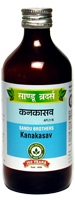

# Kanakasav

[TOC]

It is useful in acute attack of Bronchial Asthma and Cough. Bronchodilator and anti-inflammatory, mucolytic and expectorant.

## Indications
1. Bronchial asthma
1. Cough
1. Tuberculosis
1. Chronic fever

## Dose
2-4 teaspoonful twice a day.

## Ingredients
1. Datura metel
1. Adhatoda vasica
1. Piper longum
1. Solanum xanthocarpum
1. Zingiber officinale
1. Clerodendrum serratum, etc.
