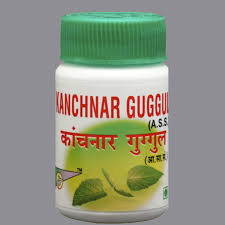

# Kanchanar Guggul

* **Kanchanar guggul** - Kanchanar guggul can be used to address deep-seated kapha imbalances. It supports healthy tissues including muscles, fat and bones as well as the Thyroid and Lymphatic gland enlargements.

Kanchanara guggul is effective in treating abnormal growths, cysts and all types of inflammations; Kanchanar Guggul is useful in chronic tumors, cancers, abdominal tumors, leprosy and other skin diseases.

* **Medohar Guggul** - Medohar Guggulu is a classical Ayurvedic Anti Obesity formula which is used to maintain proper cholesterol and weight levels.

It removes Kapha accumulations from the body gently and effectively. Ayurveda suggests using Guggulu in the treatment of 'Santarpana' born disorders. [one eats a lot, particularly high calorie diet rich in fats and carbohydrate and leads to physically lazy life and sedentary daily routine.]

Medohar Guggul speeds up the metabolism to burn more calories. It reduces the bad cholesterol.

## External Links
* [Shriji Herbal Products](http://www.indianherbalproducts.net/Exporters_Suppliers/Exporters/hp/scripts/prod_search.html?keyword=Guggul&catalog_id=17360&submit.x=0&submit.y=0)
