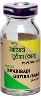

# Khadiradi Gutika

[TOC]

Acacia catechu (Khadir) has anthelmintic action and is useful in tropical eosinophilic cough
Astringent - helps to reduce secretion of excessive sputum.
Solanum surattense (Kantakari) & Adhatoda vasica (Vasa) has mucolytic, anti-inflammatory & broncho-dilator action which helps to liquefy tenacious sputum, reduces inflammation of Respiratory tract & relives broncho constriction thus helpful in cough & asthma.

## Indication
Cough & Bronchial Asthma.

## Dosage
1 tab 4-5 times in a day

## Ingredients
Acacia catechu, Inula racemosa, Pistacia integerrima, Clerodendron serratum, Terminalia chebula, Syzygium aromaticum, Zingiber officinale, Piper nigrum, Piper longum, Aconitum heterophyllum, Carum bulbocastanum, Alhagi camelorum, Tinospora cordifolia, Solanum indicum, Solanum surattense, Terminalia bellerica, Punica granatum
Decoction of - Solanum surattense, Acacia catechu, Zingiber officinale, Acacia arabica, Adhatoda vasica
