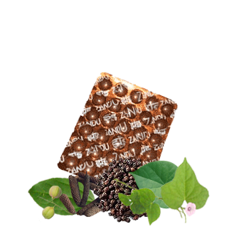

# Kishore Guggul Guti

[TOC]

Kishore Guggul Guti was first mentioned in Sharangadhara Samhita. Herbal remedy based on purified guggulu which acts as antiallergic, antibacterial and blood purifying remedy.

## Composition
Triphala (triple myrobalan), Giloya (Tinospora cordifolia), Guggul (guggulgum), Shunthi (dried ginger), Maricha (black pepper), Pippali (long pepper), Vaividanga (Emblia ribes), Jaipal (Croton tiglium root) Nishotha (Indian turpeth root).

## Dosage
1 to 4 tablets. To be taken with Brihat Manjisthadi Quath or Water or as directed by physician

* Kishore Guggul Guti is an excellent remedy for the ailments arising out of blood impurities like: Gout, abscess,cough, skin disorders, edema, abdominal disorders, anemia, urinary, disorders, indigestion, constipation, diabetic carbuncles, scrofula, ulcers, boils, tumor, chronic Otorrhoea.
