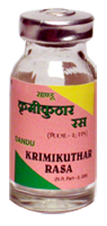

# Krumikuthar rasa

[TOC]

It is useful in all types of worm infestations e.g. Roundworm, Tapeworm, Hookworm and Threadworm. It should be used for a period of at least 21 days or more to achieve desirable results

## Indications
Worm infestation

## Dose
1-2 tablets 2 times.

## Ingredients
1. Purified Mercury,
1. Purified Sulphur,
1. Embelia ribes,
1. Feula Foetida,
1. Holarrhena antidysenterica,
1. Acorus calamus,
1. Mallotus phillippinesis,
1. Pongonia glabra,
1. Butea frondosa,
1. Punica granatum,
1. Arecia catechu,
1. Gardenia gummifera,
1. Allium sativum,
1. Souvarchal Salt,
1. carum capticum
1. Aloe vera.
