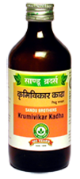

# Krumivikar Kadha

[TOC]

It is especially prepared to get rid of chronic worm infestation. It prevents recurrence of worm infestation. It’s laxative action helps expels out dead worm from the intestine.

## Indications
Worm infestation

## Dose
4 tsf 2 times

## Therapeutic Uses
Worm infestation

## Ingredients
1. Embelia ribes,
1. Cedrus deodar,
1. Azadirachta indica,
1. Trichosanthes dioica,
1. Aconitum heterophyllum,
1. Mellotus phillipinesis.
