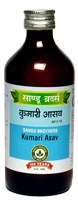

# Kumari Asava

[TOC]

It regulates bile flow into the intestine by its cholagogue action thus improves digestion and relieves constipation. It relieves obstruction of bile duct and corrects function of liver and Gall Bladder. It has hepatostimulant effect thus it corrects functional efficiency of liver.By its diuretic and laxative action it helps to eliminate toxins out of body. It contains iron and other herbs which are essential for proper absorption and assimilation of iron, thus correcting anaemia.

## Indications
1. Jaundice
1. Hepato-splenomegaly
1. Loss of appetite
1. Oedema
1. Anaemia
1. Chronic Constipation.

## Dose
4 tsf 2 times.

## Ingredients
Aloe vera, Jaggary, Honey, Zingiber officinale, Piper longum, Piper nigrum,Syzygium aromaticum, Cinnamomum zeylanicum, Elettaria cardamomum, Cinnamomum tamala, Mesua ferra, Plumbago zeylanica, Piper longum,  Embelia ribes, Piper chaba, Juniperus communis, Coriandrum sativum, Areca catechu, Picrorrhiza kurroa, Cyperus rotundus, Terminalia chebula, Terminalia bellerica, Embelica officinalis, Vanda roxburghi,  Cedrus deodar, Curcuma longa, Berberis aristata, Marsdenia tenacissima, Tinospora cordifolia , Baliospermum montanum, Inula racemosa, Sida cordifolia, Abutilon indicum, Mucuna pruriens, Tribulus terrestris, Anethum sowa, Anacyclus pyrethrum, Blepharis edulis, Boerhavvia diffusa, Symplocos racemosa, Makshikbhasma, Woodfordia fruticosa.
