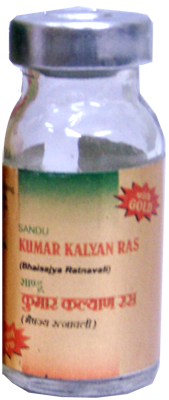

# Kumarkalyan Ras

[TOC]

It is an immuno-modular, which provides protection against diseases of children. It is useful in recurrent cough, cold and fever. It provides protection to heart. It is useful for the children who do not get sufficient amount of breast milk.

## Ingredients
1. Rassindur
1. Motipishti
1. Suvarnabhasma
1. Abhrak bhasma
1. Loh bhasma
1. Suvarnamashik Bhasma
1. Triturated with - Ghrukumari Ras (Aloe vera)

## Indications
1. Immuno-modulater
1. Cough
1. Cold Tuberculosis
1. Jaundice
1. Fever
1. Diarhoea
1. Underweight children.
