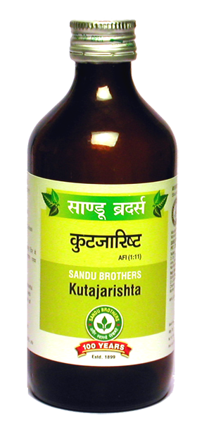

# Kutajarishta

[TOC]

1. It is effective in chronic dysentery associated with mucus, abdominal pain, fever, anorexia and tenesmus
1. In chronic dysentery, it should be continued for a longer period to prevent the relapse
1. Effective in cases of irritable bowel syndrome and ulcerative colitis

## Indications
IBS, Chronic dysentery, diarrhoea

## Dose
4 tsf 2 times

## Ingredients
Holarrhena antidysenterica, Vitis vinifera, Madhuca indica, Gmelina arborea, Woodfordia fruticosa etc.
