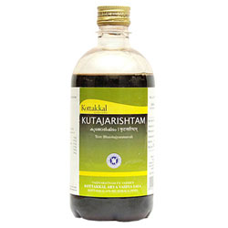

# Kutajarishtam

Kutajarishta is widely used in Ayurvedic treatment for diarrhoea, dysentery, fever, bleeding disorders of intestine irritable bowel syndrome, crohn’s disease.

## Ingredients of Kottakkal Ayurveda Kutajarishtam
* Kutaja (Holarrhena antidysenterica)- Stem bark – 4.8 kg
* Mridveeka – Dry grapes – 2.8 kg
* Madhuka (Madhuca indica) – FLower – 480 g
* Kashmari (Gmelina arborea) – Stem bark / root – 480 g
* Guda – Jaggery – 4.8 kg
* Dhataki (Woodfordia fruticosa) – flower – 960 g
