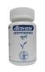

# Lavan bhaskar churna

[TOC]

## Importance
Lavan bhaskar churna is effective in loose motion, Acidity, constipation and healthy digestion.

## Dosage
6 gm to 12 gm in a day with Luke warm water.

## Indications
1. For healthy digestion
1. Removes acidity.
