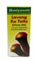

# Lavang Tel

[TOC]

## Importance
Effective medicine for mouth disease like toothache and bleeding gums and gives you germfree mouth.

## Dosage
Put few drops of lavang tel gently in mouth and move it in mouth with the help of tongue till 10-15 min.

## Indications
1. Useful for
1. Toothache
1. Bleeding gums
1. Germfree mouth.
