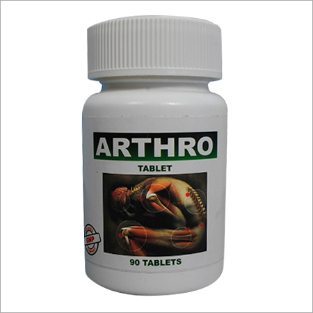

# Libra Ayur Lab Ayurvedic Medicines & Products

* Asthma Medicines - An unique Ayurvedic formulation give instant relief from different breathing problems.

* Ortho Oil -  Ortho Oil that is special Ayurvedic formula helpful to treat Joints pain, Backache, Muscular Sprain, Arthritis, and Stiffness of Joints

* Cardiac Disorder - This capsule is exclusively processed for the purpose of treating prostrate problems and Urine problem.

* Piles Medicines

* Ayurvedic Tooth Powder - Enriched with essential and exceptional herbal extracts, this powder is used for dental patients having problems like Bleeding of gums, poor dental strength, dental pain, etc.

## External Links
* [Libra Ayur Lab](http://www.libraayurlab.in/ayurvedic-medicines-products.html)
