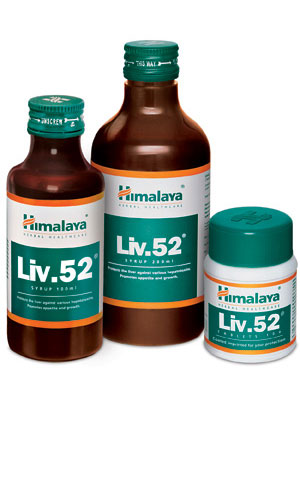

# Liv.52

The natural ingredients in **Liv.52** exhibit potent hepatoprotective properties against chemically-induced hepatotoxicity. It restores the functional efficiency of the liver by protecting the hepatic parenchyma and promoting hepatocellular regeneration. The antiperoxidative activity of Liv.52 prevents the loss of functional integrity of the cell membrane, maintains cytochrome P-450 (a large and diverse group of enzymes, which catalyze the oxidation of organic substances), hastens the recovery period and ensures early restoration of hepatic functions in infective hepatitis. It facilitates the rapid elimination of acetaldehyde (produced by the oxidation of ethanol that is popularly believed to cause hangovers) and ensures protection from alcohol-induced hepatic damage. Liv.52  also diminishes the lipotropic (compounds that help catalyze the breakdown of fat) effect in chronic alcoholism and prevents fatty infiltration of the liver. In pre-cirrhotic conditions, Liv.52 arrests the progress of cirrhosis and prevents further liver damage.

**Improves appetite**: In anorexia and less than optimal growth and weight gain, Liv.52 normalizes the basic appetite-satiety rhythm. It also addresses loss of appetite during pregnancy. As a daily health supplement, Liv.52 improves appetite, digestion and assimilation processes and promotes weight gain.

## Key ingredients
**The Caper Bush** (Himsra) contains p-methoxy benzoic acid, which is a potent hepatoprotective. It prevents the elevation of malondialdehyde (biomarker for oxidative stress) levels in plasma and hepatic cells. Caper Bush also inhibits the ALT and AST enzyme levels and improves the functional efficiency of the liver and spleen. Flavonoids present in the Caper Bush exhibit significant antioxidant properties, as well.

**Chicory** (Kasani) protects the liver against alcohol toxicity. It is also a potent antioxidant, which can be seen by its free radical scavenging property. The hepatoprotective property of Chicory suppresses the oxidative degradation of DNA in tissue debris.
