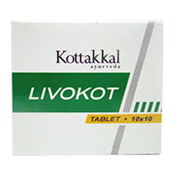

# Livokot Tablet

[TOC]

Livokot tablet is a unique herbal combination having hepato-protective function that helps in the treatment of liver disorders of varied etiology. This ideal combination of the herbs Clearing Nut Tree and Phyllanthus Plant functions as hepato-protective and liver stimulant. Long Pepper, known for its bio enhancing properties makes the formulation ideal for treating all types of liver disorders.

## Indications for use of Livokot Tablet
Jaundice, Liver disorders. Helps to cleanse & restore liver cells, protects the liver from toxic sunstances (alcohol, drugs etc). Improves Digestion, Infectious Hepatitis, Cirrhosis of the liver

## Each Livokot Tablet is prepared out of
* Kiratatikta (Swertia Chirata) - 3.33g
* Tamalaki (Phyllanthus niruri) - 3.33g
* Pippali (Piper longum) - 1.33g
* Excipients q.s
