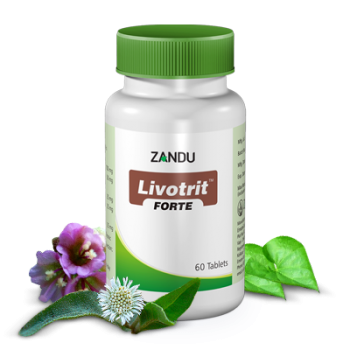

# Livotrit Forte

[TOC]

Zandu introduces extract based Forte Range of products in attractive HDPE container; herbs in extract form (100% soluble fraction) ensures better bioavailability; confirms the superiority & potency of Forte formulation with just 1 tab BD dosage. Its indication are as follows: Acute and chronic viral hepatitis, Jaundice, Adjuvant to AKT3, Chronic liver dysfunctions, Pre-cirrhotic conditions. As a daily health supplement to alcoholics and to provide protection against hepatic damage.

## Composition
Raktapunarnava(Boerhaavia diffusa) extract-40 mg, Guduchi (tinospora cordifolia) extract-40 mg, Bhringraj (Eclipta alba) extract-20 mg, Kalmegh (Andrographis paniculata) extract-20 mg, Kutki (Picrorrhiza kurroa) extract-20 mg, Bhumiamalki (phyllanthus amarus) extract20 mg, Vidang (embelia ribes) extract-12 mg, Kasni (Cichorium intybus) extract-10 mg, Rohitak (Amoora rohitaka) extract10 mg.

## Dosage
1 tablet twice daily or as directed by the physician.

* Extract based formula ensures better efficacy, potency & better disease control.
Better patient compliance with just 1 tab BD dosage compare to 2 tablet BD or TID conventional dosage.
Derived from natural source, no side effects or adverse effects reported.
