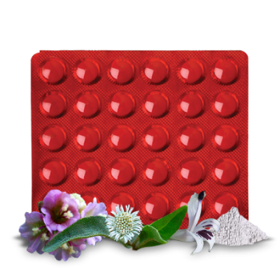

# Livotrit Tablet

[TOC]

Livotrit protects liver from hepatotoxic drugs, alcohol, infection and various other heptotoxins.
Livotrit can be co-administered as an adjuvant to AKT to avoid hepatocellular damage.
Hastens normalizing of biochemical parameters in liver disorders thereby improving appetite and digestion.
Its indication are as follows: Acute and chronic viral hepatitis, jaundice. Adjuvant to AKT. Chronic liver dysfunctions. Pre-cirrhotic conditions. As a daily health supplement to alcoholics to provide protection against hepatic damage.

## Composition
Livotrit Tablet Each sugar coated tablet contains- Arogyavardhini rasa 100 mg Mandur Bhasma 50 mg Punarnava(Boerhaavia diffusa) 25 mg Bhringraj(Eclipta alba) 25 mg Kalmegh(Andrographis paniculata) 25 mg.

## Dosage
Adults : 2 tablets twice or thrice a day.
Children : 1 tablet twice or thrice a day

* Livotrit controls the symptoms of nausea and vomiting in hepatic dysfunction.
Livotrit promotes hepatocellular regeneration.
Livotrit promotes biliary flow.
