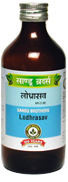

# Lodhrasav

[TOC]

Effective in Menorrhagia and Leucorrhoea
It is an uterine tonic. It corrects menstrual disorders. It also has digestive, blood purifier and laxative properties.

## Indications
1. Menorrhogia
1. leucorrhoea
1. skin diseares
1. bleeding piles
1. grahani (Irritable bowel syndrome)

## Dose
4 tsf 2 times

## Ingredients
Symplocos racemosa, Mersdenia tenacissima, Hedychium spicatium, embelia ribes, clerodendrum serratam, valeriana wallichii, Holarrhens antidysenterica (seeds), Areca catechce, Callicarpa macrophylla etc.
