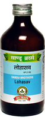

# Lohasav

[TOC]

It is an excellent combination of Lohabhasma with other essential herbs. Lohasav is indicated for treatment of Iron deficiency anaemia. While Lohabhasma rapidly improves Haemoglobin level, trikatu ensures better absorption & assimilation.
It does not cause Gastrointetinal disturbance or Constipation. It also possess anthelmintic propertyby virtue of Embelia ribes and Plumbago zeylanica. It ensures constant and stable rise in haemoglobin.

## Indications
1. Iron deficiency anaemia
1. Jaundice
1. Chronic fever.

## Dose
4 tsf 2 times a day with equal quantity of water.

## Ingredients
1. Lohabhasma,
1. Zingiber officinale,
1. Piper longum,
1. Piper nigrum,
1. Embelica officinalis,
1. Terminalia chebula,
1. Terminalia belerica,
1. Embelia ribes,
1. Plumbago zeylanica,
1. Cyperus rotundus,
1. Woodfordia fruticosa,
1. Honey,
1. Jaggary.
