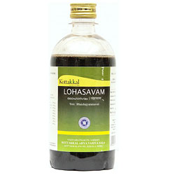

# Lohasavam

Lohasava is used as Ayurvedic medicine for Anemia. Apart from anemia, lohasava is also used in the treatment of swelling, inflammation, liver and spleen conditions, itching, cough, fistula, certain digestive diseases.

## Ingredients of Kottakkal Ayurveda Lohasavam
* Guda
* Kasudra
* Loha
* Nagara
* Maricha
* Pippali
* Haritaki
