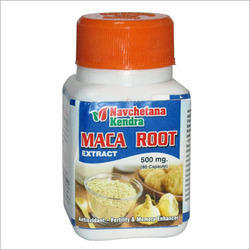

# Maca Root Powder

Maca Root Powder for the use of increasing fertility which directly can affect fertility for both men and women.

Maca is a root vegetable cultivated high in the mountains of peru-for thousands of years locals have revered the plant as a savior, sustaining them in a climate and altitude where it is virtually impossible to grow any other crop. Ground into powdered form for easy consumption. maca (when non irradiated ) remains high in important nutrients like trace minerals, EFAs ,amino acids and vitamins pure and unadulterated just as nature intended.

## External Links
* [Navchetana Kendra Health Care Private Limited](http://www.herbalextractsmanufacturers.com/maca-root-powder.html)
