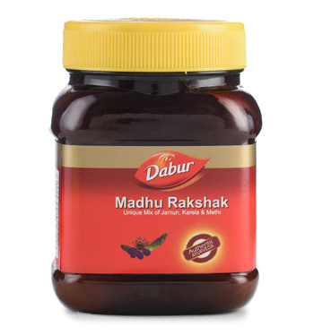

# Madhu Rakshak

**Dabur Madhu Rakshak** is a unique blend of Jamun, Karela, Methi and numerous other natural ingredients which aim to protect you from the harmful effects of diabetes and its related problems.

## Key Ingredients
* Jamun
* Karela
* Methi
* Neem leaves
