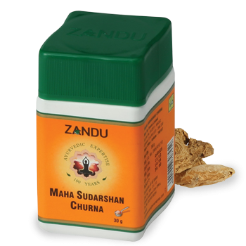

# Maha Sudarshan Churna

[TOC]

* Improves immunity build-up
1. Helps protect the body from common infections viz, Cold, Body aches etc
1. Helps recovery from infections & chronic illness
1. Helps reduce stress & fatigue, act as antioxidant

BENEFIT TO THE CONSUMER
"Helps keep you healthy and lead an active life

## Composition
Kiratatikta (Swertia chirata), Haritaki (Terminalia chebula), Bibhitaki (Terminalia belerica), Amalaki (Emblica officinalis), Haridra (Curcuma longa), Daruharidra (Berberis ariststa), Brihati (Solanum indicum), Kantkari (Solanum xanthocarpum), Shati (Carcuma zedoaria), Shunthi (Zingiber officinale), Marich (Piper nigrum), Pippali (Piper longum), Pippalimool (Piper longum root), Moorva (Sansevieria roxburghiana), Guduchi (Tinospora cordifolia), Dhamasa (Fagonia arabica), Katuki (Picrorrhiza kurroa), Parpat (Fumaria parviflora), Musta (Cyperus rotundu

## Dosage
1/2 to 2 teaspoonful with water three times a day or as directed by the physician.

* Restores homeostasis of all three dosha. Boosts immunity to fight against allergens and infections. Excellent diaphoretic and Diuretic. Preventive and supportive during epidemic of malaria, allergic cough & cold. Supportive in tuberculosis, recurrent, respiratory infection, indigestion, ama (endotoxicity).
