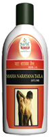

# Mahanarayan Tel

[TOC]

1. It provides strengthens nerves, muscles and ligaments.
1. It relieves muscle and joint stiffness. It reduces pain and inflammation.
* It is the medicated oil containing essential ingredients which are demulcent, anodyne and strengthening effect on muscles. Shatavari (Asparagus racemosus) a unique ingredient traditionally known for its role as a nervine tonic and adding strength to the musculature, Milk for its demulcent properties.  This medicated oil is specially indicated for external applications by way of massage of the affected part of the body during the phase of cerebral stroke. It enhances cutaneous and capillary blood circulation, adds strength and is a great help during the phase of physiotherapy, which is a part of the re-habilitation process in stroke. Sandu Mahanarayan Tail gives excellent result in stroke patients when given in the form of enema, from where its gets absorbed into the intestinal mucosa and produces desired results.

## Indications
Osteo-arthritis
stroke
Bell’s palsy
Parkinson’s disease
cervical spondylitis
Vata-Disorders

## Dose
1. External application - As per requirement
1. Enema -	60-200 ml.
1. Internal use -	6 ml. with lukewarm water or milk
1. Nasal Therapy ( Nasya): 2 to 8 drops in each nostril.

## Ingredients
1. Withania somnifera
1. Solanum surattense
1. Sida cordifolia
1. Tribulus terrestris
1. Oroxylum indicum
1. Abutilon indicum
1. Sida veronicaepetia
1. Stereospermum suaveolens
1. Cinnamomum camphora
1. crocus sativus etc.
