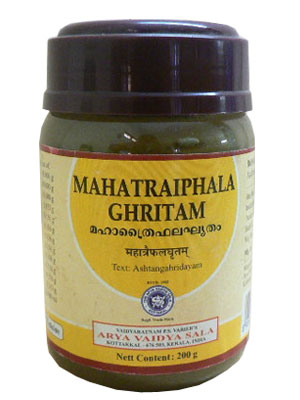

# Mahatraiphala Ghritam

[TOC]

Maha Triphala Ghrita is a medicated ghee which acts as an excellent eye toner. It can be used internally as well as externally (Akshi Tarpana).
It improves vision, regulates intra-ocular pressure (Glaucoma), reduces infections (Conjunctivitis) and delayes Degenerative Diseases of the Eye like Cataract.

## INDICATIONS
* Night Blindness
* Early Stage of Cataract Mole
* Growth in layers of Eyes
* Conjunctivitis
* Glaucoma
* Trichiassis/Entropion
* Chronic dacrocystitis/Epiphora
* Itching in Eye
* Hypermetropia/Hyperopia
* Myopia

## Composition
Each 10 ml prepared out of :
* Ghritam 10.000g
* Markava 10.000g
* Vasa 10.000g
* Vara (each) 0.833g
* Yasthimadhu 0.156g
* Dvikakoli (each) 0.156g
* Vyaghri 0.156g
* Krishna 0.156g
* Amrita 0.156g
* Utpala 0.156g
* Draksha 0.156g
* Sita 0.313g
* Ajaksheera 10.000m
