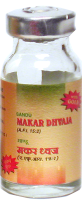

# Makardhwaja

[TOC]

1. Useful in Erectile dysfunction
1. Effective in impotence
1. Useful in Premature ejaculation
1. Nourishes heart and brain
1. Strengthens body
1. improves blood circulation
1. Useful in Spermatorrhoea
1. Ensures nutrition to all the seven dhatu (body tissues) of the body

## Indications
1. Erectile dysfunction
1. Premature ejaculation
1. Oligospermia
1. Heart disease
1. General debility.

## Dose
1 tab 2 times

## Ingredients
[Suvarna bhasma](Suvarna_bhasma.md)
[Kajjali](Kajjali.md)
[Gossypium herbaceum](Gossypium_herbaceum.md)
[Aloe vera](Aloe_vera.md)
