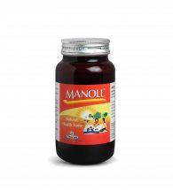

# Manoll Syrup

**Nature's promise of good health**
MANOLL is herbomineral potent antioxidant. The main ingredient Amalaki (Emblica officinalis) is a rich source of flavonoids like quercetin, emblicanin-A and emblicanin-B, which are potent antioxidants. Gokshura (Tribulus terrestris), Ashwagandha (Withania somnifera), Guduchi (Tinospora cordifolia) are adaptogenic and immunity boosters. Pippali (Piper longum) and Shunthi (Zingiber officinale) further enhance the bioavailability of antioxidants. Shunthi (Zingiber officinale) also has a profound antiinflammatory effect that helps to control inflammatory responses in the body. Beetroot (Beta vulgaris), Palak (Spinacia oleracea) and Mandur Bhasma build up haemoglobin levels. Honey in Manoll syrup is an instant and sustained source of energy. Manoll reinforces resistance against infections and ensures rapid recovery and cuts short convalescence period after a long illness or surgery.
