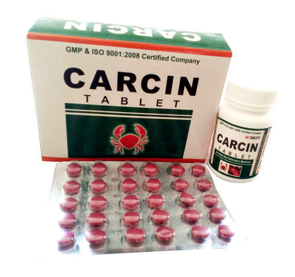

# Medicines for immunity

[TOC]

**Carcin Tablet (Anti Cancer Drug)**

## Indication:
* An Ayurvedic Treatment for CANCER & MALIGNANCY.
* Acute and chronic Leukemia.
* Ca. Cervix and Prostate.
* Carcinoma of head and neck.

## Composition:
* Guduchi Ext............40 mg.
* Suddha Bhallatak....20 mg.
* Gojivha...................60 mg.
* Mandur Bhasma......5 mg.
* Varun......................10 mg.
* Suddha Gugul..........30 mg.
* Kanchar Chhal.........20 mg.
* Rakta Rohitak..........10 mg.
* Praval Pisti...............2.5 mg.
* Tulsi.........................40 mg.
* Makardwaj..............2.5 mg.
* Kumari Ext...............50 mg.

## External Links
* [Ayursun Pharma](http://www.ayursun.in/carcin-tablet-anti-cancer-drug--1069660.html)
