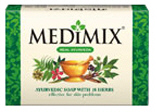

# Medimix Soap

[TOC]

**Medimix** Ayurvedic Bath Soap is the world’s largest selling ayurvedic bath soap that is suited for all skin types. It is completely herbal with a 60% coconut oil base and contains no animal fat. It is known for its curative, preventive and beautifying qualities for skin, scalp and hair. The rich lather of Medimix Ayurvedic Bath Soap is enriched by the extracts of 18 Herbs scientifically incorporated to give protection from various skin problems. The natural oil base of Medimix Ayurvedic Soap contains pure coconut oil. Traditionally handcrafted as per the strict Ayurvedic formulation, Medimix is packed with natural ingredients, making it perfectly safe even for a baby's tender skin. Contains no animal fat.

## Benefits of Medimix Soap
1. Prevents skin infection.
1. Protects skin from problems like black heads, pimples, itches, prickly heat.
1. Controls dandruff.
1. Controls body odor.
1. Safe, effective skin & hair cleanser.

## Medimix Soap Ingredients Include:
1. Andropogan muricatus, Hemidesmus indicus and Coriandrum sativam prevent prickly heat
1. Plumbago rosea and Berberis aristata prevent pimples
1. Cedrus deodara and Melia azadirachta are Natural Antiseptics
1. Acorus calamus, Psoralea corylifolia and Glycyrrhiza glabra Prevent dandruff
1. Holarrhena antidysentrica, Cuminum cyminum, Embelia ribes, Celastrus paniculatus, Zingiber zerumbet, Nigella sativa and Smilax china Deodorize and beautify the skin.
1. Chitraka 225mg
1. Vanardraka 108mg
1. Sariba 12mg
1. Chopchini 6mg
1. Nimba Twak 4mg
1. Dharu Haridra 2mg
1. Vacha 2mg
1. Usheeram 2mg
1. Dhanyaka 2mg
1. Jeeraka 2mg
1. Vidangam 2mg
1. Yashtimadhu 2mg
1. Kutaja 2mg
1. Jyothismathi 2mg
1. Devadaru 2mg
1. Krishna Jeeraka 2mg
1. Bakuchi 2mg
1. Guggulu 1.75mg.

## Use Directions
Use daily in place of regular soap.
